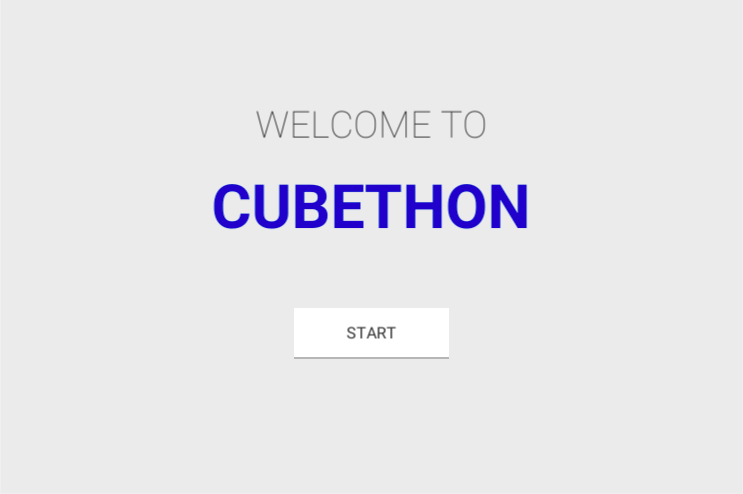
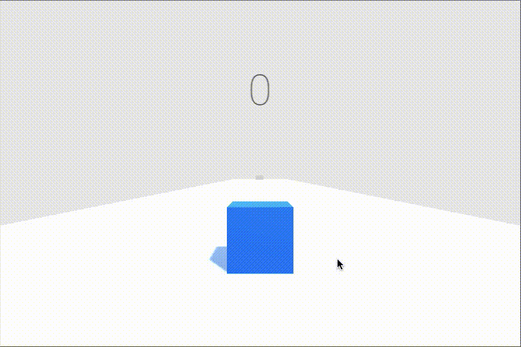
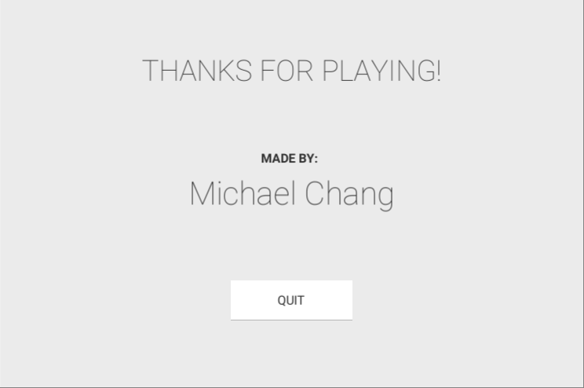

# CUBETHON

- This is my first 3D Unity game. 
- Use C# and UnityEngine Library to write scripts for the logic behind the game.
- Explore the usage of C# and Unity framework for game development.
- [Check out the demo on Youtube](https://youtu.be/bXnCz2kZ8Gs)

## Starting Menu


## Gameplay
- use ```a``` key to go left, and ```d``` key to right



## Credit Scene


## For Development
- Go to ```Assets/Scripts/``` to see the source code
- Go to ```Assets/Scenes/``` to see the level design, menu, and credits scene

## References
- [Brackeys: How to make a Video Game in Unity](https://www.youtube.com/playlist?list=PLPV2KyIb3jR53Jce9hP7G5xC4O9AgnOuL)
